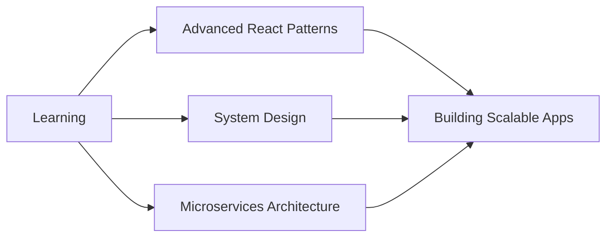

# 👋 Hi there, I'm Fasalu Rahman

### Full Stack Developer | MERN Specialist | UI/UX Enthusiast

---

## 🚀 About Me

I'm a passionate **Full Stack Developer** specializing in the **MERN stack**, transforming complex requirements into elegant, scalable solutions. With a keen eye for **UI/UX design** and a commitment to clean code, I build applications that users love.

- 🔭 Currently working on **Enterprise ERP & CRM Solutions**
- 🌱 Exploring **Advanced React Patterns**, **TypeScript**, and **System Architecture**
- 👯 Open to collaborate on **Open Source Projects**
- 💬 Ask me about **React, Node.js, MongoDB, System Design**
- ⚡ Fun fact: **I turn coffee into code ☕️ → 💻**

---

## 💼 Featured Projects

<table>
<tr>
<td width="50%">

### 🏢 Enterprise ERP System
**Full-stack ERP solution for business management**

**Tech Stack:** React.js, Node.js, MongoDB, Redis

**Features:**
- 📊 Real-time analytics dashboard
- 👥 Employee & HR management
- 💰 Financial tracking & reporting
- 📦 Inventory management
- 📈 Sales & purchase workflows

</td>
<td width="50%">

### 🤝 CRM Software Platform
**Customer relationship management system**

**Tech Stack:** Next.js, Express, PostgreSQL, Socket.io

**Features:**
- 🎯 Lead management & tracking
- 📧 Email campaign automation
- 📞 Call logging & history
- 📊 Sales pipeline visualization
- 🔔 Real-time notifications

</td>
</tr>
<tr>
<td width="50%">

### 🛍️ E-commerce Platform
**Modern baby shop with payment integration**

**Tech Stack:** MERN, Razorpay, JWT, Redux

**Features:**
- 🛒 Shopping cart & wishlist
- 💳 Secure payment gateway
- 📱 Responsive design
- 👤 User authentication
- 🔍 Advanced product filtering

</td>
<td width="50%">

### 📝 Task Management System
**Real-time collaborative workspace**

**Tech Stack:** React, Node.js, Socket.io, MongoDB

**Features:**
- ⏱️ Real-time collaboration
- 📋 Kanban board interface
- 👥 Team management
- 🔔 Push notifications
- 📊 Progress tracking

</td>
</tr>
</table>

---

## 🛠️ Tech Stack & Tools

### Frontend Development

### Backend Development

### Database & Cache

### DevOps & Tools

### Design Tools

### Testing & Quality

---

## 📊 GitHub Statistics

  
  

 

### 🏆 GitHub Trophies

 
  

---

## 📈 Contribution Graph

  

---

## 🎯 Current Focus

**Current Learning Path:**
- 🏗️ System Design & Architecture Patterns
- 🔄 Microservices with Node.js
- 🚀 Performance Optimization Techniques
- 🔐 Advanced Security Best Practices
- ☁️ Cloud Services (AWS/Azure)
- 🤖 AI/ML Integration in Web Apps

---

## 💡 Coding Activity

<!--START_SECTION:waka-->
<!--END_SECTION:waka-->

  

---

## 🤝 Let's Connect & Collaborate

I'm always interested in hearing about new opportunities, collaborations, and interesting projects. Feel free to reach out!

---

## 💖 Support My Work

If you like my work and want to support me, consider:

---

### ⚡️ "Code is like humor. When you have to explain it, it's bad." – Cory House

**Thanks for visiting my profile! Have a great day! 🚀**

---

**© 2024 Fasalu Rahman | Made with ❤️ and lots of ☕**

⭐️ From [fa-salu](https://github.com/fa-salu)

